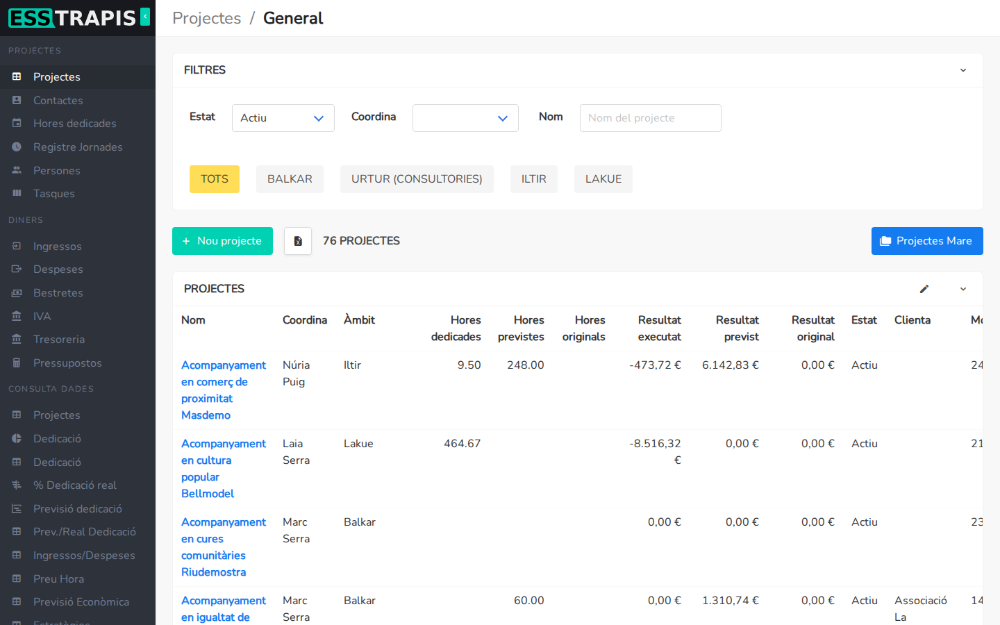
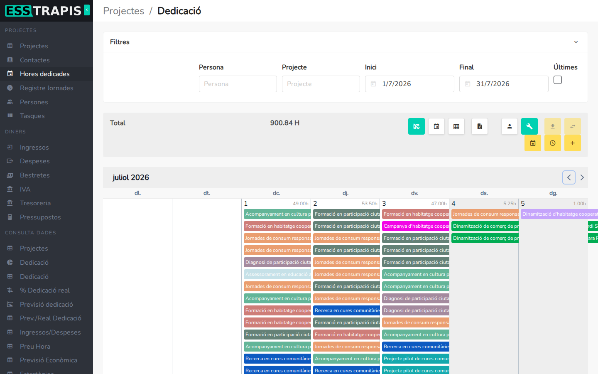
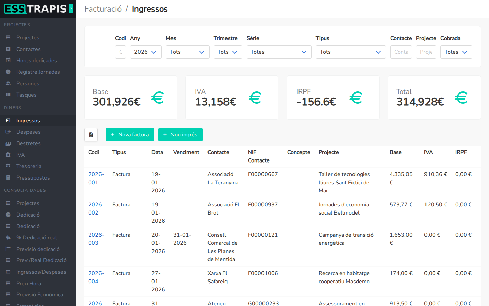
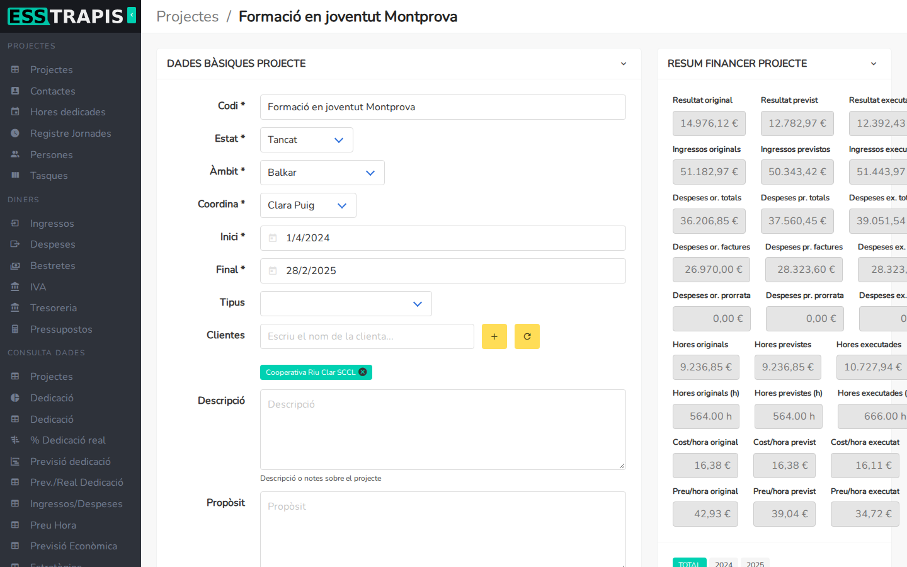
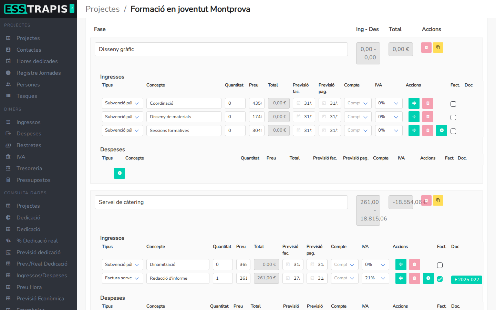
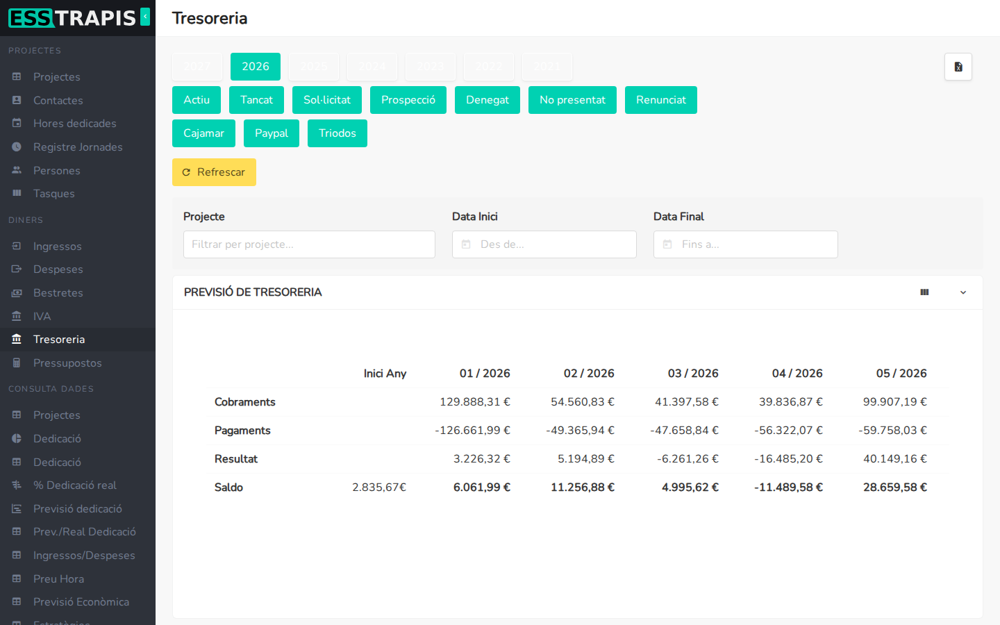
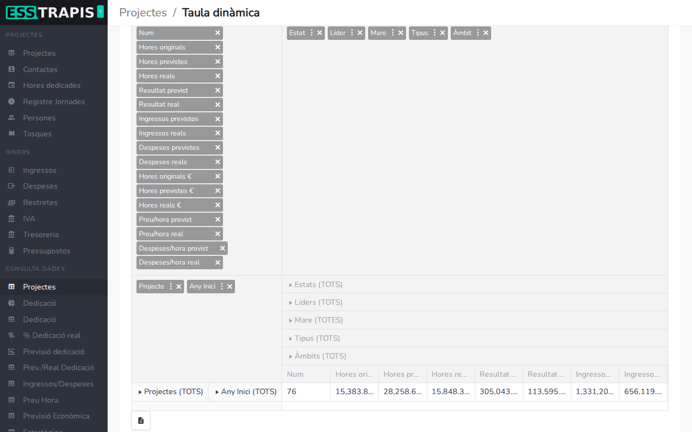

# 00. Què és ESSTRAPIS

> Permís necessari: cap

ESSTRAPIS és una aplicació web de gestió pensada per a cooperatives i entitats de l'economia social i
solidària. Reuneix en un sol lloc la gestió de **projectes**, les **hores** que hi dedica cada persona,
els **diners** que entren i surten (factures, nòmines, IVA, tresoreria) i, per a les entitats que en fan,
la **logística** de comandes i repartiment.

L'objectiu és saber, en tot moment, si cada projecte va com es va pressupostar: quant s'havia previst
ingressar, gastar i dedicar-hi, i quant s'ha ingressat, gastat i dedicat de debò.



## Per a qui és

- **Persones sòcies i treballadores**: imputen les hores que dediquen a cada projecte, fitxen la jornada i
  consulten el seu saldo d'hores.
- **Coordinació de projectes**: crea els projectes, en fa el pressupost per fases, en segueix la
  planificació i les tasques.
- **Administració i finances**: emet i registra factures, controla l'IVA, les bestretes i la tresoreria, i
  prepara les justificacions de subvencions.
- **Logística** (només en algunes entitats): proveïdors que entren comandes, l'equip que les reparteix i
  l'equip que les gestiona i factura.

Cada usuari veu al menú només les seccions que li permeten els seus permisos (vegeu el capítol
[02. Usuaris, rols i permisos](02-usuaris-rols-permisos.md)).

## Les grans àrees

El menú lateral s'organitza en aquests blocs:

| Bloc del menú | Per a què serveix |
|---|---|
| **Projectes** | Projectes, contactes (clients i proveïdors), hores dedicades, registre de jornades, persones i tasques. |
| **Diners** | Ingressos (factures emeses), despeses (factures rebudes), bestretes, IVA, tresoreria i pressupostos. |
| **Logística** | Comandes, dipòsits, punts d'entrega i de consum, rutes, incidències i la seva facturació. |
| **Consulta dades** | Informes en forma de taules dinàmiques i gràfics: projectes, dedicació, ingressos i despeses, previsió econòmica, preu hora, estratègies, intercooperació, subvencions… |
| **Administració** | Configuració de l'entitat, usuaris, facturació electrònica (Verifactu, FACe) i les taules auxiliars (estats, tipus, sèries, comptes bancaris…). |
| **Altres** | Importar i exportar dades, connexió amb Contasol, registre de canvis de l'aplicació. |





## Com encaixen les peces

Tot gira al voltant del **projecte**:

```
                         ┌───────────── Contactes (clients, proveïdors)
                         │
Pressupostos ─► PROJECTE ─┼── Fases ──┬── Ingressos previstos ──► Factures emeses ──┐
                         │           ├── Despeses previstes ───► Factures rebudes ─┼──► Tresoreria, IVA
                         │           └── Hores previstes                           │
                         │                                                          │
                         ├── Hores dedicades (persones × cost/hora) ──► Bestretes ──┘
                         ├── Tasques i planificació (Gantt)
                         └── Subvencions ──► Justificacions
```

1. Un **projecte** té un client (o més), unes dates, una persona que el coordina i un estat (els estats
   els defineix cada entitat a Administració).
2. El projecte es divideix en **fases**. A cada fase s'hi preveuen **ingressos**, **despeses** i
   **hores** de les persones que hi treballaran.
3. Quan es factura, la **factura emesa** es lliga a l'ingrés previst de la fase; quan arriba una factura
   d'un proveïdor, la **factura rebuda** es lliga a la despesa prevista. Així es veu què s'ha complert del
   pressupost.
4. Cada persona **imputa les hores** que dedica al projecte. Com que cada persona té un **cost per hora**
   (definit a la seva jornada laboral), les hores també són un cost del projecte.
5. Amb tot això, ESSTRAPIS calcula el **resultat** de cada projecte (ingressos − despeses − cost de les
   hores) i alimenta la **tresoreria** (quins cobraments i pagaments hi haurà i quan) i l'**IVA**.







## Tres maneres de mirar un projecte: original, previst i executat

Aquesta idea apareix a moltes pantalles i informes:

- **Original**: el pressupost tal com es va aprovar al principi. Queda fixat i serveix de referència.
- **Previst**: el pressupost actualitzat. Es pot anar modificant a mesura que el projecte avança (més
  hores, una despesa nova, un ingrés que es retarda…).
- **Executat** (o real): el que ha passat de debò: factures emeses i rebudes i hores imputades.

Al **Resum financer** de cada projecte es veuen els tres costat per costat: *Resultat original*, *Resultat
previst* i *Resultat executat*, i el mateix per als ingressos, les despeses i les hores.

Comparar-los respon preguntes com: «Hem dedicat més hores de les que vam pressupostar?» o «Aquest any
tancarem el projecte amb benefici?».

## Què més pot fer

- **Pressupostos** i factures proforma per a clients, vinculats al projecte, amb el seu PDF.
- **Facturació electrònica**: registre de factures a **Verifactu** i enviament a l'administració pública
  per **FACe**.
- **Subvencions**: imports per any, cofinançament i preparació de les **justificacions** amb nòmines i
  factures.
- **Taules dinàmiques**: tots els informes es poden reorganitzar, filtrar, desar com a vista i exportar a
  Excel.

  
- **Logística**: des de l'entrada d'una comanda fins al repartiment, les incidències i la facturació a les
  sòcies.

## Vegeu també

- [Glossari](00-glossari.md)
- [01. Primers passos](01-primers-passos.md)
- [Índex del manual](README.md)
